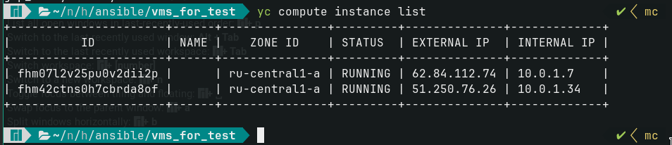
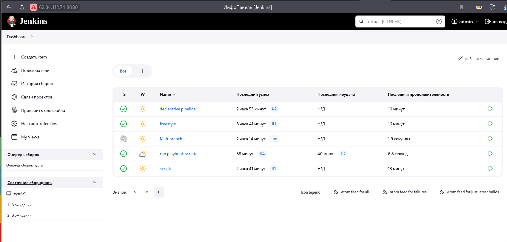
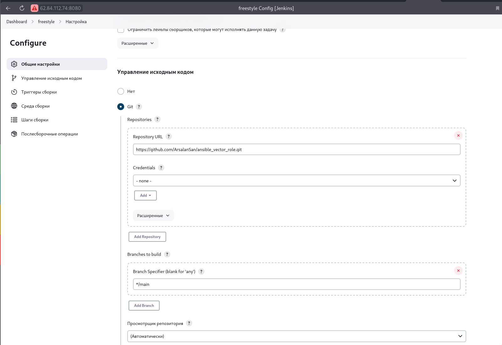
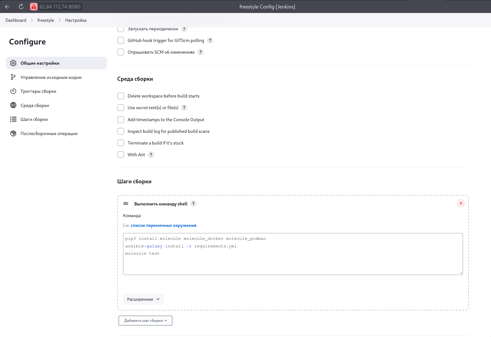
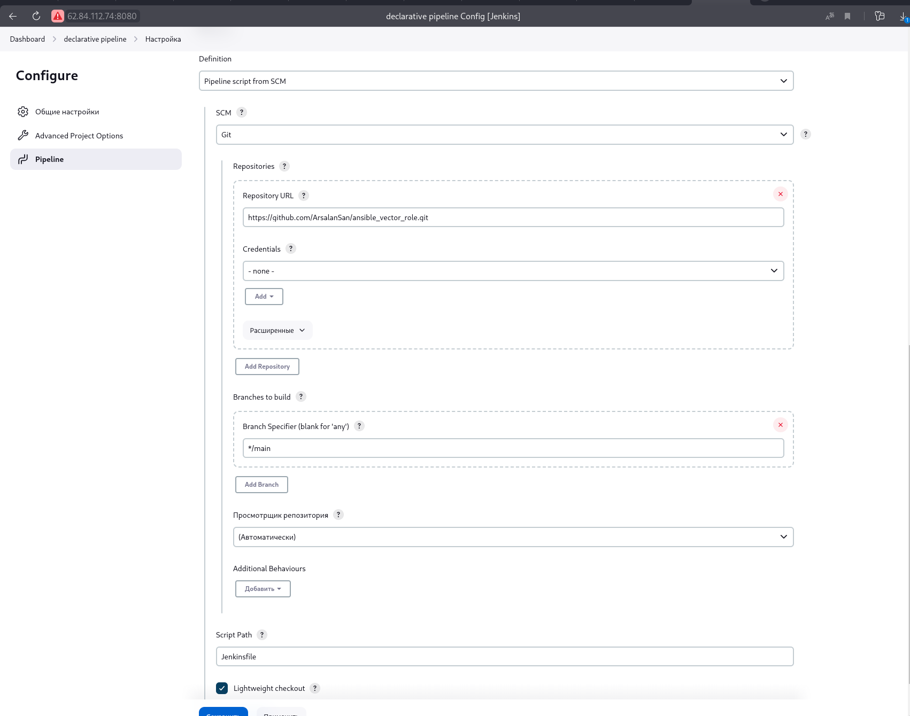
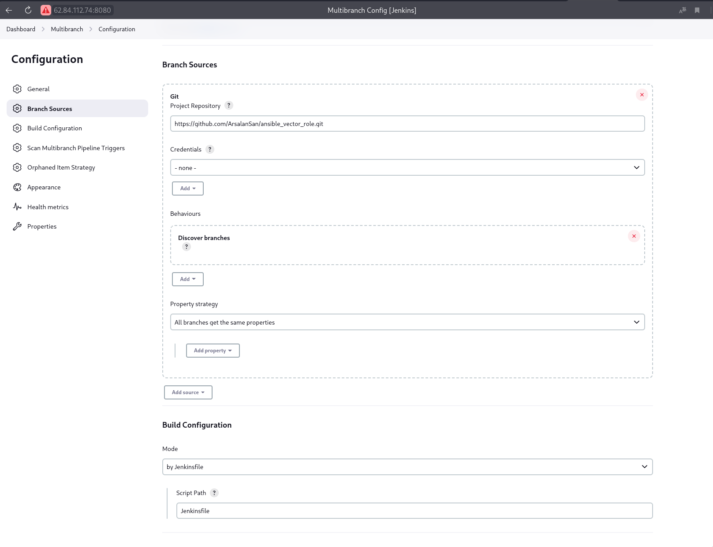
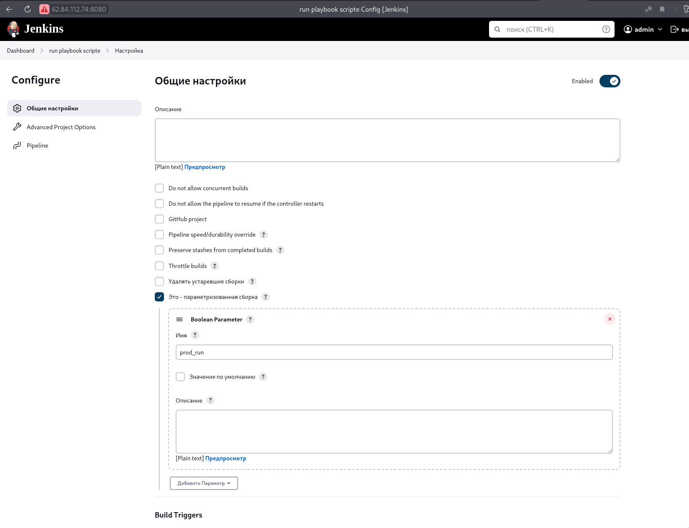
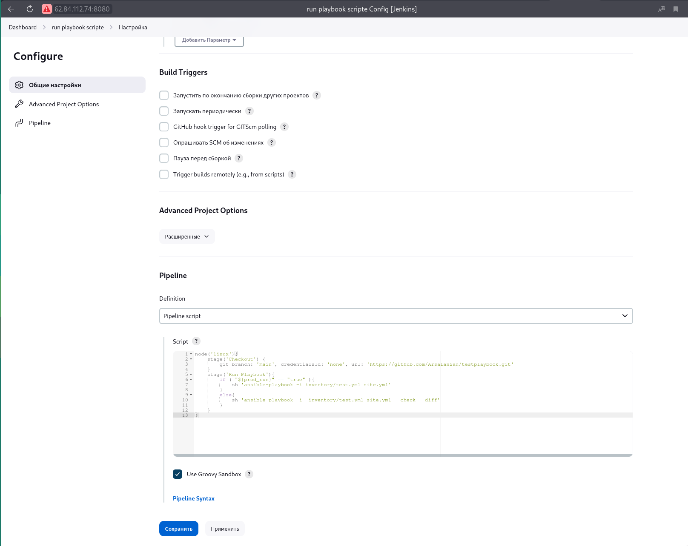

# Домашнее задание к занятию 10 «Jenkins»

## Подготовка к выполнению

1. Создать два VM: для jenkins-master и jenkins-agent.
2. Установить Jenkins при помощи playbook.
3. Запустить и проверить работоспособность.
4. Сделать первоначальную настройку.
   
   

## Основная часть

1. Сделать Freestyle Job, который будет запускать `molecule test` из любого вашего репозитория с ролью.
   
   
2. Сделать Declarative Pipeline Job, который будет запускать `molecule test` из любого вашего репозитория с ролью.
   
3. Перенести Declarative Pipeline в репозиторий в файл `Jenkinsfile`.
   > https://github.com/ArsalanSan/ansible_vector_role/blob/main/Jenkinsfile
4. Создать Multibranch Pipeline на запуск `Jenkinsfile` из репозитория.
   
5. Создать Scripted Pipeline, наполнить его скриптом из [pipeline](./pipeline).
6. Внести необходимые изменения, чтобы Pipeline запускал `ansible-playbook` без флагов `--check --diff`, если не установлен параметр при запуске джобы (prod_run = True). По умолчанию параметр имеет значение False и запускает прогон с флагами `--check --diff`.
   
   
7. Проверить работоспособность, исправить ошибки, исправленный Pipeline вложить в репозиторий в файл `ScriptedJenkinsfile`.
   > https://github.com/ArsalanSan/ansible-hw/blob/main/09-ci-04-jenkins/ScriptedJenkins
8. Отправить ссылку на репозиторий с ролью и Declarative Pipeline и Scripted Pipeline.
   > Ссылка нв [роль](https://github.com/ArsalanSan/ansible_vector_role.git)
   
   > [Declarative Pipeline](https://github.com/ArsalanSan/ansible_vector_role/blob/main/Jenkinsfile)

   > [Scripted Pipeline](https://github.com/ArsalanSan/ansible-hw/blob/main/09-ci-04-jenkins/ScriptedJenkins)
