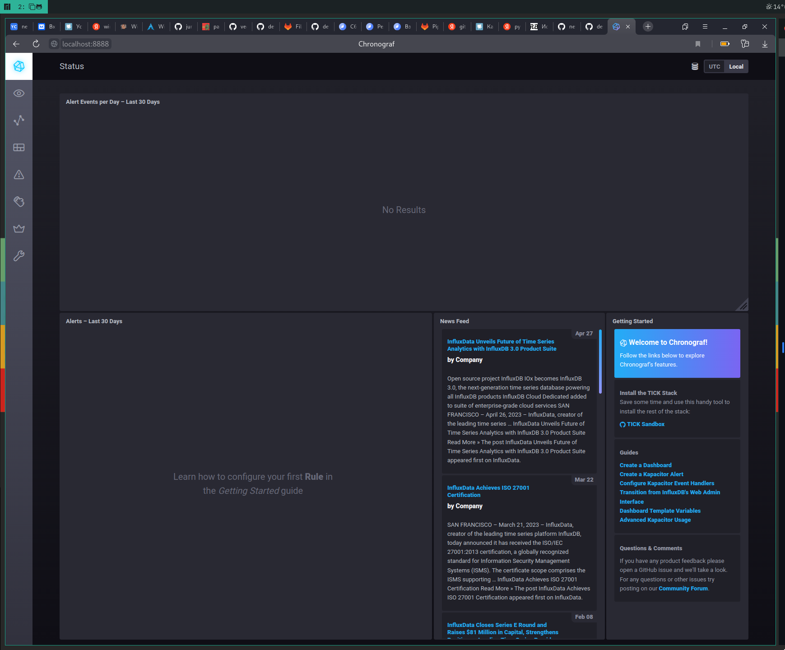
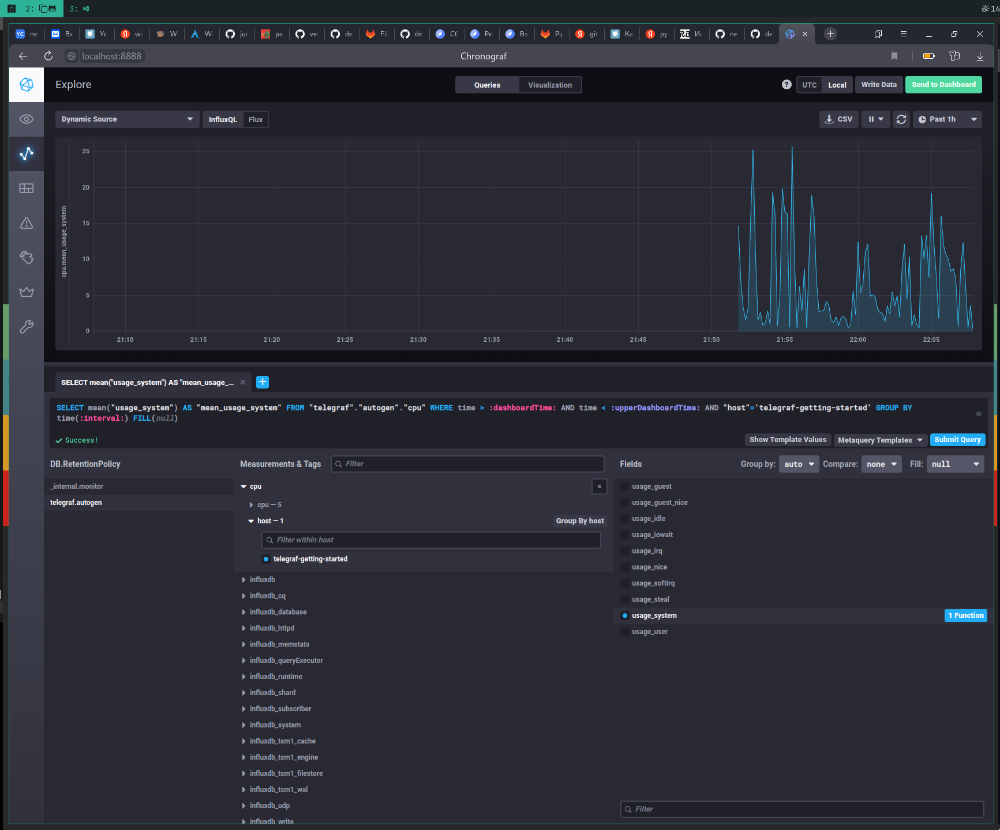
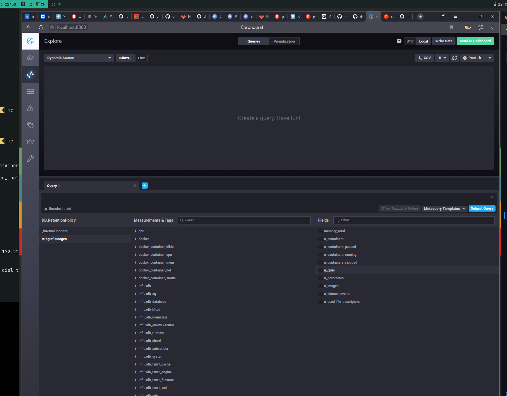

# Домашнее задание к занятию 13 «Введение в мониторинг»

## Обязательные задания

1. Вас пригласили настроить мониторинг на проект. На онбординге вам рассказали, что проект представляет из себя платформу для вычислений с выдачей текстовых отчётов, которые сохраняются на диск. 
Взаимодействие с платформой осуществляется по протоколу http. Также вам отметили, что вычисления загружают ЦПУ. Какой минимальный набор метрик вы выведите в мониторинг и почему?

    > * Нагрузка на процессор(очередь,утилизация)
    
    > * Нагрузка на оперативную память(объем свободной памяти)

    > * Дисковое пространство(общий объем дискового пространства, скорость выполнения операций чтения/записи)

    > * Сети(использование полосы пропускания)

    > * Количество HTTP запросов и ошибок

2. Менеджер продукта, посмотрев на ваши метрики, сказал, что ему непонятно, что такое RAM/inodes/CPUla. Также он сказал, что хочет понимать, насколько мы выполняем свои обязанности перед клиентами и какое качество обслуживания. Что вы можете ему предложить?
   
    > Выделить ключевые метрики и визуализировать с помощью Grafana, определить уровень и качаство обслуживания.

3. Вашей DevOps-команде в этом году не выделили финансирование на построение системы сбора логов. Разработчики, в свою очередь, хотят видеть все ошибки, которые выдают их приложения. Какое решение вы можете предпринять в этой ситуации, чтобы разработчики получали ошибки приложения?
   
    > Продукты с открытым исходным кодом. Пример - стэк ELK 
   
4. Вы, как опытный SRE, сделали мониторинг, куда вывели отображения выполнения SLA = 99% по http-кодам ответов. 
Этот параметр вычисляется по формуле: summ_2xx_requests/summ_all_requests. Он не поднимается выше 70%, но при этом в вашей системе нет кодов ответа 5xx и 4xx. Где у вас ошибка?

    > (summ_2xx_requests + summ_3xx_requests)/(summ_all_requests)

5. Опишите основные плюсы и минусы pull и push систем мониторинга.

    |Push-модель|Pull-модель|
    |-----------|-----------|
    |ожидает подключений от агентов для получения метрик|сам подключается к агентам мониторинга и забирает данные|
    |быстрее реагирует на изменения в системе|экономит ресурсы системы мониторинга|
    |более эфективен в больших системах|позволяет более гибко настраивать мониторинг|

6. Какие из ниже перечисленных систем относятся к push модели, а какие к pull? А может есть гибридные?
    
    |Система мотиронига |Модель|
    |-------------------|------|
    |Prometheus|pull/push|
    |TICK|push|
    |Zabbix|pull/push|
    |VictoriaMetrics|push|
    |Nagios|pull|

7. Склонируйте себе репозиторий и запустите TICK-стэк, используя технологии docker и docker-compose. В виде решения на это упражнение приведите скриншот веб-интерфейса ПО chronograf (http://localhost:8888).
   
   

8. Перейдите в веб-интерфейс Chronograf (http://localhost:8888) и откройте вкладку Data explorer.
    
    * Нажмите на кнопку Add a query
    * Изучите вывод интерфейса и выберите БД telegraf.autogen
    * В measurments выберите cpu->host->telegraf-getting-started, а в fields выберите usage_system. Внизу появится график утилизации cpu.
    * Вверху вы можете увидеть запрос, аналогичный SQL-синтаксису. Поэкспериментируйте с запросом, попробуйте изменить группировку и интервал наблюдений.
  
    Для выполнения задания приведите скриншот с отображением метрик утилизации cpu из веб-интерфейса.

    

9. Изучите список [telegraf inputs](https://github.com/influxdata/telegraf/tree/master/plugins/inputs). Добавьте в конфигурацию telegraf следующий плагин - [docker](https://github.com/influxdata/telegraf/tree/master/plugins/inputs/docker):
    ```
    [[inputs.docker]]
    endpoint = "unix:///var/run/docker.sock"
    ```
    Дополнительно вам может потребоваться донастройка контейнера telegraf в `docker-compose.yml` дополнительного volume и 
    режима privileged:
    ```
    telegraf:
      image: telegraf:1.4.0
      privileged: true
      volumes:
        - ./etc/telegraf.conf:/etc/telegraf/telegraf.conf:Z
        - /var/run/docker.sock:/var/run/docker.sock:Z
      links:
        - influxdb
      ports:
        - "8092:8092/udp"
        - "8094:8094"
        - "8125:8125/udp"
    ```
    После настройке перезапустите telegraf, обновите веб интерфейс и приведите скриншотом список `measurments` в 
веб-интерфейсе базы telegraf.autogen . Там должны появиться метрики, связанные с docker.

    