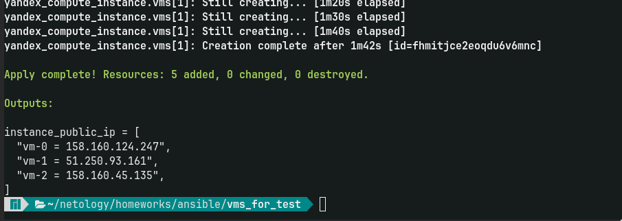
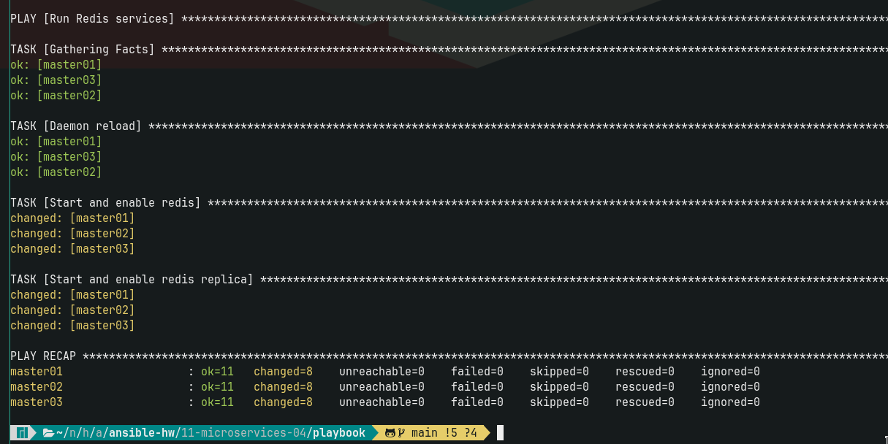
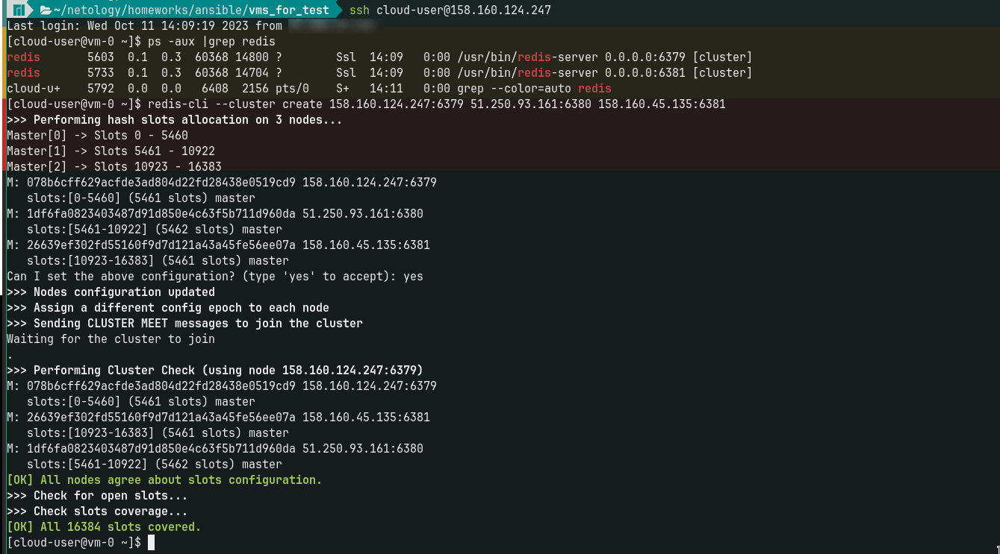
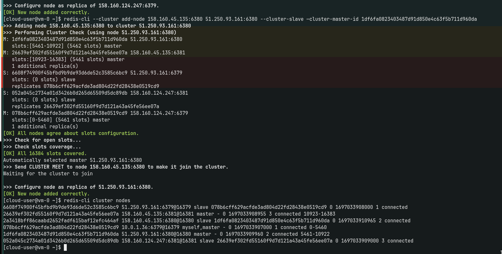

# Домашнее задание к занятию «Микросервисы: масштабирование»

Вы работаете в крупной компании, которая строит систему на основе микросервисной архитектуры.
Вам как DevOps-специалисту необходимо выдвинуть предложение по организации инфраструктуры для разработки и эксплуатации.

## Задача 1: Кластеризация

Предложите решение для обеспечения развёртывания, запуска и управления приложениями.
Решение может состоять из одного или нескольких программных продуктов и должно описывать способы и принципы их взаимодействия.

Решение должно соответствовать следующим требованиям:
- поддержка контейнеров;
- обеспечивать обнаружение сервисов и маршрутизацию запросов;
- обеспечивать возможность горизонтального масштабирования;
- обеспечивать возможность автоматического масштабирования;
- обеспечивать явное разделение ресурсов, доступных извне и внутри системы;
- обеспечивать возможность конфигурировать приложения с помощью переменных среды, в том числе с возможностью безопасного хранения чувствительных данных таких как пароли, ключи доступа, ключи шифрования и т. п.

> Чек лист в пользу Kubernetes: 
> * выполняет все требования
> * стабильно работает
> * проверен на большом количестве компаний
> * продукт поддерживается и большая команда разработки
> * бесплатный 
> * очень легко найти специалистов и низкий порог входа для имеющихся специалистов
>
>Остальные конкуренты либо платные или не выполняют требования. В целом думаю надо ориентироватся на инфраструктуру, если компания имеет свою ифраструктуру, то однозначно Kubernetes. Если облачная ифраструктура, то лудше использовать готовое решение от облачного провайдера.

## Задача 2: Распределённый кеш * (необязательная)

Разработчикам вашей компании понадобился распределённый кеш для организации хранения временной информации по сессиям пользователей.
Вам необходимо построить Redis Cluster, состоящий из трёх шард с тремя репликами.

### Схема:

Создал 3 вм в ЯндексОблаке с помощью terrraform:

Установил и сделал первоначальне настройки Redis с помощью ansible: [install_redis.yml](/playbook/install_redis.yml)

Далее настроил кластер "ручками":

* создал кластер 
  
* добавил реплики и результат на скрине
  

